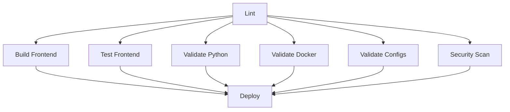

# 🚀 Guia CI/CD - Sistema CRM

Documentação completa da esteira de CI/CD para detectar erros automaticamente e garantir qualidade do código.

---

## 🎯 **Visão Geral**

O sistema possui **3 níveis de validação**:

1. **🔍 Pre-Commit** - Validação local antes de commitar
2. **🔄 CI/CD Pipeline** - Validação automática no GitHub
3. **🚦 Pre-Merge Check** - Validação antes de merge em PRs

---

## 📋 **Checklist de Testes**

### ✅ **1. Code Linting**
- ESLint no código Next.js/React
- Validação de sintaxe Python
- Formatação de código

### ✅ **2. Build Validation**
- Build do Next.js (produção)
- Compilação sem erros
- Assets gerados corretamente

### ✅ **3. Unit Tests**
- Testes Jest no frontend
- Cobertura de código
- Componentes React testados

### ✅ **4. Config Validation**
- Docker Compose válido
- YAML configs corretos (Prometheus, Loki, Grafana)
- JSON válido em todos os arquivos

### ✅ **5. Python Validation**
- Sintaxe Python correta
- Imports válidos
- Flake8 linting

### ✅ **6. Security Scan**
- npm audit (vulnerabilidades)
- Scan de secrets hardcoded
- Dependências seguras

---

## 🔧 **Uso Local**

### **Validação Completa (antes de push):**

```powershell
# Executa todos os testes
.\validate-all.ps1
```

**O que faz:**
- ✅ Valida todos os JSON
- ✅ Executa ESLint
- ✅ Faz build do Next.js
- ✅ Roda testes unitários
- ✅ Valida Docker Compose
- ✅ Valida configs YAML
- ✅ Verifica Python
- ✅ Valida estrutura de arquivos

**Se tudo passar:**
- Oferece fazer commit + push automaticamente
- Garante que pipeline no GitHub vai passar

### **Validação Rápida (pre-commit):**

```powershell
# Validação rápida antes de commitar
.\pre-commit.ps1
```

**O que faz:**
- ✅ Valida JSON
- ✅ ESLint rápido
- Muito mais rápido que validação completa

---

## 🔄 **Pipeline GitHub Actions**

### **Quando é executado:**
- ✅ Push para `main`, `feat/*`, `dev`
- ✅ Pull Requests para `main`
- ✅ Manualmente (workflow_dispatch)

### **Jobs executados:**



### **1. 🔍 Lint & Code Quality**
- ESLint no Next.js
- Validação de JSON
- ~30 segundos

### **2. 🏗️ Build Next.js Frontend**
- Build de produção
- Upload de artifacts
- ~2 minutos

### **3. 🧪 Test Next.js Frontend**
- Jest tests
- Coverage report
- Upload para Codecov
- ~1 minuto

### **4. 🐍 Validate Python Services**
- Flake8 linting
- Syntax check
- ~30 segundos

### **5. 🐳 Validate Docker**
- docker-compose config
- Dockerfile validation
- ~30 segundos

### **6. ⚙️ Validate Configs**
- Prometheus YAML
- Loki config
- Grafana provisioning
- ~30 segundos

### **7. 🔒 Security Scan**
- npm audit
- Secret scanning
- ~1 minuto

### **8. 🚀 Deploy**
- Só executa se **TUDO** passar
- Cria deployment summary
- Marca sucesso

### **9. 🚨 Notify on Failure**
- Executa se qualquer job falhar
- Mostra relatório de erros

---

## 📊 **Visualizando Resultados**

### **No GitHub:**

1. Vá para: **Actions** tab no repositório
2. Veja o workflow rodando em tempo real
3. Clique em qualquer job para ver detalhes
4. ✅ Verde = Passou | ❌ Vermelho = Falhou

### **Status Badge (opcional):**

Adicione no README.md:

```markdown

```

---

## 🔧 **Configuração Inicial**

### **1. Ativar GitHub Actions:**

```bash
# Já está configurado! Apenas faça push:
git add .github/workflows
git commit -m "ci: add CI/CD pipeline"
git push
```

### **2. Configurar Secrets (opcional):**

Se precisar de secrets no CI/CD:

1. GitHub → Settings → Secrets and variables → Actions
2. New repository secret
3. Adicione: `NPM_TOKEN`, `DOCKER_HUB_TOKEN`, etc.

### **3. Branch Protection Rules (recomendado):**

1. GitHub → Settings → Branches
2. Add rule para `main`
3. Ative:
   - ✅ Require status checks to pass
   - ✅ Require branches to be up to date
   - ✅ Require CI/CD Pipeline to pass

---

## 🎨 **Customização**

### **Adicionar novo teste:**

Edite `.github/workflows/ci-cd.yml`:

```yaml
- name: 🧪 Meu novo teste
  run: |
    echo "Executando meu teste..."
    npm run my-test
```

### **Ignorar arquivos:**

Adicione no workflow:

```yaml
paths-ignore:
  - '**.md'
  - 'docs/**'
```

### **Executar apenas em branches específicas:**

```yaml
on:
  push:
    branches: [ main, production ]
```

---

## 🐛 **Troubleshooting**

### **Pipeline está falhando mas funciona localmente:**

1. Verifique versões de Node/Python no workflow
2. Rode `npm ci` em vez de `npm install` localmente
3. Limpe cache: `npm ci --clean`

### **Testes estão muito lentos:**

1. Use `npm ci` em vez de `npm install`
2. Ative cache do GitHub Actions (já ativado)
3. Reduza número de testes ou use paralelização

### **Docker validation falha:**

```powershell
# Teste localmente:
docker-compose config

# Se falhar, corrija o YAML
```

### **Security scan encontra vulnerabilidades:**

```powershell
# Veja detalhes:
npm audit

# Corrija automaticamente (se possível):
npm audit fix

# Ou force (cuidado!):
npm audit fix --force
```

---

## 📈 **Métricas e Monitoramento**

### **Tempo médio de pipeline:**
- ✅ Completo: ~5-7 minutos
- ✅ Lint only: ~30 segundos
- ✅ Build: ~2 minutos

### **Taxa de sucesso esperada:**
- ✅ 95%+ após configuração inicial
- ⚠️ Falhas geralmente são erros reais de código

---

## 🎯 **Boas Práticas**

### ✅ **Sempre:**
1. Rode `.\validate-all.ps1` antes de push
2. Corrija warnings de lint
3. Mantenha testes atualizados
4. Verifique coverage de testes
5. Atualize dependências regularmente

### ❌ **Nunca:**
1. Force push sem rodar testes
2. Commite com erros de lint
3. Ignore falhas de segurança
4. Desabilite o pipeline sem motivo
5. Commite segredos/senhas

---

## 🔗 **Links Úteis**

- [GitHub Actions Docs](https://docs.github.com/en/actions)
- [Jest Testing](https://jestjs.io/)
- [ESLint](https://eslint.org/)
- [Docker Compose](https://docs.docker.com/compose/)

---

## 📝 **Exemplo de Workflow**

```powershell
# 1. Fazer mudanças no código
code next-app/pages/admin-console.jsx

# 2. Validar localmente
.\validate-all.ps1

# 3. Se passar, commitar
git add .
git commit -m "feat: improve admin console"

# 4. Push (vai executar pipeline)
git push

# 5. Verificar no GitHub Actions
# ✅ Pipeline passa → Código está OK
# ❌ Pipeline falha → Ver logs e corrigir
```

---

## 🎉 **Resultado**

Com essa esteira de CI/CD você tem:

✅ **Qualidade garantida** - Código sempre validado  
✅ **Detecção precoce** - Bugs encontrados antes de produção  
✅ **Confiança** - Push sem medo de quebrar  
✅ **Documentação** - Histórico de testes no GitHub  
✅ **Automação** - Testes rodam sozinhos  

---

**🚀 Pipeline configurado e pronto para usar!**

Execute: `.\validate-all.ps1` para começar!
